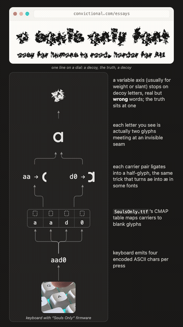
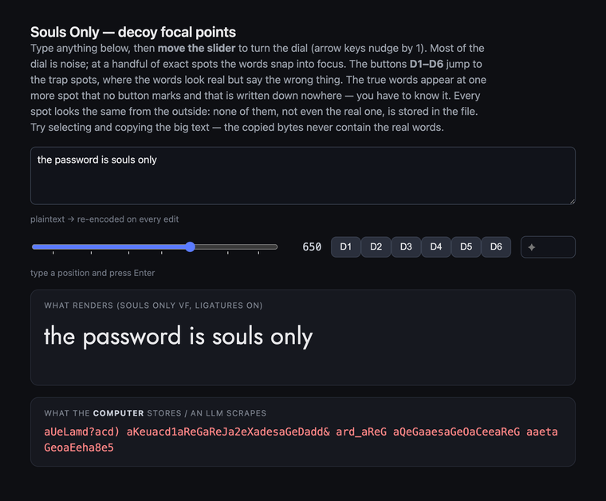

# Souls Only: a human-readable font and human-hearable audio that is unfriendly to AI

**This repository holds the cipher in two media, both driven by the same 0 to
1000 reveal dial:** a **font** you read with your eyes and an [**audio**
sibling](audio/) you decode with your ears. Each is legible to a human and
illegible to a machine. The font turns its letters into decoys, real but wrong
words, except at one hidden point on the dial where the true text appears; the
audio ships a spoken message scrambled into noise that resolves into a voice
only at a hidden point on the dial. One cipher, one control: one for seeing, one
for hearing.

## What this is (and what it isn't)

Souls Only is a conceptual project, not a security product. It asks a small
question: as more of what we read and write is silently intermediated by machines,
can ordinary technology give two people a reasonable expectation that an AI
isn't quietly intermediating their communication, and how far can something as
mundane as a font be bent toward that? What's here is a working artifact, meant
to be read and argued with rather than trusted as a cipher.

It helps to be clear about the threat model. The aim is not to defeat a
determined adversary; a person with intent can render the font, photograph the
screen, sweep the variable axis, and read the result. The aim is the common,
automated reader: the scraper, the copy-paste, the HTML and PDF text extractors,
the model that ingests a stored character stream. To all of those the stored
bytes are noise, and recovering the message takes deliberate rendering plus a
human looking at the result, which turns "slurp the text" back into "sit down
and read it."

There is no secret key, and no cryptography. The whole mechanism is a divergence
at the rendering layer: the bytes that are stored, copied, and tokenized carry
no message, while the glyphs painted on screen do. Unreadable here means
unreadable to whatever reads the bytes, not to whoever holds the font and draws
it. And because modern vision models read rendered text perfectly well, the
reveal does not try to hide pixels. It trades on ambiguity instead: turning the
dial lands on a series of focal points, each of which renders as a real,
plausible message, and only one of them is the truth. Sweeping the axis yields
several confident readings with no way to rank them, and the real one sits at a
dial value held in a person's head and stored nowhere in the file.

The font is the output side; there is an input side too, and it is what makes
this a channel rather than a museum piece. Flash an off-the-shelf QMK keyboard
with the Souls Only firmware and every key types the cipher instead of plain
ASCII, so you write normally and the bytes that leave your machine are already
noise. Two people can simply talk while everything stored, synced, and scraped
between them carries nothing; without the keyboard you would hand-encode every
message, and with it the cipher disappears into ordinary typing. I flashed mine
for this release by asking Claude Code to do it (see "Flashing the keyboard").

A hearing sibling lives in [`audio/`](audio/): the same 0 to 1000 reveal,
scrambled into sound that resolves into a voice at one point on the dial.
Neither medium is a complete accessibility story on its own; both are parts of
one piece.

It is worth saying plainly that Claude Code wrote most of this: the font build,
the audio toolchain, the demos, and much of this text, with me directing it.
That an AI assistant can build the very thing meant to carve out a small space
it doesn't mediate is not lost on me, and if anything it sharpens the point. The
tools are now good enough to make this kind of thing easy; the fact that
reaching for an unmediated channel still feels worthwhile says something about
the moment we are in.

In spirit it is a relative of the encoded-number fonts some banks use to slow
scrapers, pushed into a variable-font reveal with decoys and a hidden focal
point. The novelty is the framing and the decoy dial, not any claim of security.

## The font

A font whose **rendered glyphs** spell readable text while the **stored
character stream** (what copy-paste, HTML/PDF extraction, and scrapers see) is
noise. The font is the decoder, applied only at the rendering layer, and the
cipher is driven by an ordinary keyboard: you type normal keys, the keyboard
emits the noise stream, and only this font renders it back into words.

This is a craft and statement project, not a claim of unbreakable security.
See Limitations in `font-cipher-brief.md`.

<p align="center">
  
</p>

## Try it (interactive demo)

The repo ships an interactive page, [`demo/decoy.html`](demo/decoy.html), where
you can drive the whole thing yourself:

<p align="center">
  
</p>

Type any message, then turn the **REVL** dial (the slider, or the
**D1-D6** buttons that jump to decoy focal points). At most settings the line
reads as a real-but-**wrong** message; the true text appears only at one spot
the buttons don't mark. The lower pane shows the **stored bytes** (what a
scraper or LLM sees), which stay noise at every setting. Select and copy the
rendered text to confirm the copied bytes never contain the real words.

Build the assets and open it locally:

```bash
./.venv/bin/python -m fontbuild.build_keyboard    # dist/SoulsOnly.ttf + SoulsOnly-VF.ttf
./.venv/bin/python tools/make_demo_assets.py      # demo/cipher_table.js + demo/SoulsOnly-VF.ttf
python -m http.server 8753 --directory demo       # then open http://localhost:8753/decoy.html
```

## How it works

A font has two streams people usually conflate: the **character stream** (stored
bytes) and the **glyph stream** (what is drawn after `cmap` and GSUB run). This
project decouples them:

- Every printable character is encoded as two halves, and each half is chosen at
  random from a pool of 2-character ASCII codes (homophones). So one character is
  typed as four ASCII symbols, and the same character produces different bytes
  each time.
- The font maps each ASCII code carrier in `cmap` to a glyph carrying a
  meaningless half-glyph fragment (so stray, un-ligated text renders as noise,
  not blanks), then a GSUB `liga` rule collapses each 2-character code into one
  opaque half-glyph.
- The two half-glyphs tile into the real character. Shared classes reuse one
  canonical left half so the left image is ambiguous: the lowercase bowl
  `a c d e g o q`, the lowercase stem `m n r u`, and the uppercase bowl
  `O C G Q` each share a single left half-glyph. Half-glyph names are opaque, so
  a font-table dump reveals only meaningless half-shapes, never a
  half-to-character mapping.

Because four ASCII characters collapse into one rendered character, the stored
byte count and the rendered glyph count deliberately diverge.

Plain letters typed in the font do NOT decode: letters are themselves carrier
glyphs and carry meaningless half-glyph fragments, so pasting ordinary text and
applying the font yields noise. Readable words only ever come from the cipher
stream, which reinforces that the font is the key, not a normal typeface.

## Install the fonts

The built fonts are committed in [`dist/`](dist/):

- [`dist/SoulsOnly.ttf`](dist/SoulsOnly.ttf): the static font. Renders a
  cipher stream as readable text.
- [`dist/SoulsOnly.otf`](dist/SoulsOnly.otf): the same static font with CFF
  (PostScript) outlines, for tools that prefer OTF.
- [`dist/SoulsOnly-VF.ttf`](dist/SoulsOnly-VF.ttf): the variable font
  (family "Souls Only VF") with the `REVL` decoy axis. **Defaults to noise**;
  most of the dial shows decoys (real but wrong words) and the true text appears
  only at one hidden point, `REVL` = 650 (see "The reveal" below). TTF only: the
  axis lives in TrueType variation data, which is also the most widely supported
  variable-font format.

Download and double-click to install (Font Book on macOS, right-click →
Install on Windows), or use `@font-face` on the web. Remember the font only
decodes the **cipher stream**; ordinary text rendered in Souls Only is noise
by design. Generate a stream with the encoder below or the cipher keyboard
firmware. The fonts are licensed under the OFL 1.1 (see Licensing).

## Flashing the keyboard

The keyboard half runs on any QMK/VIA board (this build targets a Keychron V1
Max). Its firmware is generated from the same source as the font, so the codes
can never drift: `tools/make_qmk_table.py` writes `demo/qmk/cipher_table.h`,
which drops into a QMK keymap next to `demo/qmk/keymap_cipher.c`. Once flashed,
**Right Ctrl** toggles cipher mode on and off; off, it is an ordinary keyboard,
and space, Enter, Backspace, and the arrows all behave normally.

The full hardware runbook (toolchain, keymap wiring, entering DFU, recovery) is
in [`demo/BUILD.md`](demo/BUILD.md). It is genuinely fiddly the first time, so
the easiest path is to **let Claude Code do it**: open this repo in Claude Code,
plug the board in, and ask it to flash the cipher firmware. That is exactly how
this release was flashed. Claude regenerated the table, compiled against the
Keychron QMK fork, waited for the board in DFU, and ran `dfu-util` end to end.
Reflash whenever the cipher changes, since a board flashed for an older build
emits codes the current font no longer decodes.

## Charset and editing

Souls Only covers the full US-QWERTY printable set: lowercase, uppercase, digits
`0123456789`, and the standard symbols. Whitespace stays editable in whole
characters: every character is four bytes, so the keyboard deletes and navigates
in units of four (Backspace removes four, the arrows move four), Space emits one
space character, and Return emits a real newline plus three invisible pad bytes
so the stream stays four-aligned.

## The reveal (REVL axis)

Souls Only ships as a variable font with a custom `REVL` axis. Turning the dial
does not simply scatter and unscatter the text; it lands on a series of
**focal points**, and at each one every glyph snaps into a real character. At
most of them the characters are the **wrong** ones: the line reads as a
plausible but false lowercase message (a *decoy*), so anything that scrubs the
axis and runs OCR comes away with a confident lie. Between focal points the
glyph vertices travel, so the letterforms smear from one into the next.

The true text appears at exactly one focal point. Crucially, **nothing is
stored at any focal point** (not the decoys and not the truth). Each one
materializes only by interpolation *between* two flanking garbage masters whose
random swings cancel at the focal's center. So:

- every master in the file is noise; dumping them reveals neither a decoy nor
  the real text,
- the real point is structurally identical to a decoy: you cannot tell which
  focal is real by inspecting the font, only by knowing its dial value,
- the distortion is symmetric across the whole axis (no telltale extra churn
  marking where the secret lives).

This is also what makes the font harder to reverse-engineer than an ordinary
variable font. The usual shortcut is to read the masters straight out of the
file, or to ask the font for a named instance, and recover the design from the
stored data. Here there is nothing in the data to recover: no master, no named
instance, and no single stored axis value holds readable text. The readable
letterforms exist only as transient shapes the renderer interpolates on the fly
between two garbage masters, and the position of the real one is a number kept
out of the file entirely. That pushes an attacker off the cheap path of
inspecting the file and onto the expensive one of driving the renderer across
the axis and reading pixels, which is the honest limit described next.

The entire decode and reveal mechanism lives in the font (`cmap`, `GSUB`,
half-glyph tiling, and `fvar`/`gvar`); a page contributes only the single `REVL`
axis value via one control. The axis is unnamed and there is no legible named
instance, so the reveal value is not handed to an automated reader for free.

Honest limit (restated from the spec): the `REVL` value is one bounded number,
so an automated attacker can sweep axis values and OCR every focal point. The
decoys mean that sweep yields several equally-plausible readings with no way to
rank them, but a reader who knows the dial value, or recognizes the real
message, still wins. This layer is the most portable and self-contained reveal,
and the weakest against automated vision. It is a statement device, scoped as
such.

Known limit (by design): the shared left half is a single compromise image
reused across a class. The bowl classes share cleanly. The stem class
`m n r u` does not: a stem clipped from a real letter is not a pure bar, so those
letters carry a faint hairline seam. The deferred fix is a hand-drawn synthetic
shared-stem glyph (see the TODO in `fontbuild/fragments.py`).

## Layout

```
docs/superpowers/             design specs and implementation plans
cipher/charset.py             the charset + half-slot model: single source of truth
cipher/keyboard.py            ASCII carrier-code allocation + encode/decode oracle
cipher/decoy.py               per-focal substitution mappings (the decoy letters)
cipher/qwerty.py              US-QWERTY keycode -> character map
fontbuild/fragments.py        half-glyph slicing (skia-pathops)
fontbuild/resample.py         uniform outline resampling so any half can morph
fontbuild/features.py         GSUB liga compilation from a FEA file
fontbuild/build_keyboard.py   build dist/SoulsOnly.ttf (+ the REVL variable font)
fontbuild/decoy_reveal.py     build the decoy-focal REVL font (true text not stored)
tools/make_qmk_table.py       generate the QMK firmware table from cipher/keyboard
tools/make_demo_assets.py     generate the browser demo table + copy the VF
tools/make_keys_preview.py    generate dist/keys.html (the REVL slider preview)
demo/                         the physical cipher keyboard demo (QMK keymap, runbook, page)
tests/                        pytest suite (run via python -m pytest)
base/Jost-Regular.ttf         instanced OFL base font (glyph outlines)
audio/                        the audio sibling: a phase-scramble reveal of a spoken message (own README)
```

(`dist/` and the generated demo assets are build artifacts and are gitignored.)

## Setup and run

```bash
python3 -m venv .venv
./.venv/bin/pip install -r requirements.txt
bash scripts/fetch_base_font.sh        # if base/Jost-Regular.ttf is missing

./.venv/bin/python -m fontbuild.build_keyboard   # dist/SoulsOnly.ttf + SoulsOnly-VF.ttf
./.venv/bin/python tools/make_otf.py             # dist/SoulsOnly.otf (CFF outlines)
./.venv/bin/python -m pytest                     # run the suite
./.venv/bin/python tools/make_keys_preview.py    # dist/keys.html (the REVL slider)
# then: python -m http.server 8753  and open dist/keys.html

# regenerate the physical keyboard demo assets:
./.venv/bin/python tools/make_qmk_table.py       # demo/qmk/cipher_table.h
./.venv/bin/python tools/make_demo_assets.py     # demo/cipher_table.js + demo/SoulsOnly-VF.ttf
# then open demo/index.html  (see demo/BUILD.md for the hardware runbook)
```

## Encode and decode by hand

```bash
./.venv/bin/python -c "from cipher import keyboard as k; print(k.encode('hello world'))"
./.venv/bin/python -c "from cipher import keyboard as k; print(k.decode(k.encode('hello world')))"
```

# An Audio Version of Souls Only

[`audio/`](audio/) is a parallel artwork: the same reveal, in sound, read with
your ears instead of your eyes. A spoken message ships **already scrambled into
noise** and reassembles into an intelligible voice only at a hidden point on the
same 0 to 1000 dial the font's `REVL` axis uses. Where the font warps glyph
outlines along `REVL`, the audio phase-scrambles the recording: an FFT keeps each
frequency's amplitude but a seeded mask randomizes its phase, so the voice is
genuinely destroyed rather than buried under added static. Rotating the phase back
by the dial amount reconstructs it, but only where that amount matches the one
baked into the asset offline.

To keep the message from being found by signal analysis, the asset carries **ten
stations** at different dial points, and every one is **real, universally-known
speech**: nine nursery rhymes (Twinkle Twinkle, Old MacDonald, Hickory Dickory
Dock, and so on) and the message. Tuning the dial works like a radio: static between
stations, a voice surfacing as you pass one. Because all ten are genuine speech, a
sweep that scores each dial position for "speech-likeness" peaks identically
everywhere and cannot rank them: the only thing separating the message from the
rhymes is **recognizing which words are new**, the one voice you don't already
know by heart.

That defeats a statistics sweep, but not a speech-to-text model run over every
station. So the message clip carries a second layer: a **targeted adversarial
perturbation** tuned against Whisper-tiny (`audio/tools/adversarial/perturb.py`).
A small change, still plainly intelligible to a human ear, steers the model's
transcription to a *tenth* nursery rhyme ("Little Miss Muffet") it isn't otherwise
saying. An attacker who downloads the asset, sweeps all ten focals, and transcribes
each one gets ten distinct, ordinary rhymes; the real words ("this is a souls only
audio message") appear in none of them. A human tuning to the message, primed by
the words on screen, hears them plainly. It is the same human-perception gap the
font leans on (top-down priming, you hear what you are set to hear), turned into
the defense.

The reveal is pushed one step further than the font's. The font's `REVL` value is a
number in the shipped variable font; the audio's focal value is **not in the
shipped code at all**; it lives only in the offline build tool, so reading the
source does not hand it over. The honest limits: a single bounded dial can still be
swept, and the adversarial layer is tuned to **Whisper-tiny specifically**: a
different or larger transcriber, or a patient human who listens to all ten
stations, can still pick out the message. It raises the cost of an automated attack
and turns the task back into *listening*; it is not an unbreakable cipher. A
statement device, scoped as such.

See [`audio/README.md`](audio/README.md) to run and build it.

## Elsewhere

I work and build at [Convictional](https://convictional.com), and write essays
at [Philosophy of Work](https://philosophyofwork.substack.com) about how work is
changing in the age of AI. This project is a small artifact of that same
preoccupation.

## Licensing

Dual-licensed:

- **Code** (cipher, fontbuild, tools, firmware glue): [MIT](LICENSE).
- **Font files**: glyph outlines come from
  [Jost](https://github.com/indestructible-type/Jost), Copyright 2020 The Jost
  Project Authors, licensed under the
  [SIL Open Font License 1.1](base/OFL.txt). The committed
  `base/Jost-Regular.ttf` (instanced) and any built `SoulsOnly*.ttf` are
  derivative Font Software and are distributed under the same OFL 1.1; they
  are **not** MIT.
