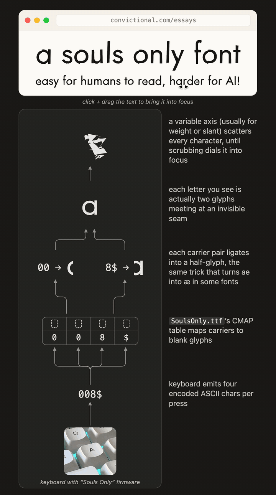

# Souls Only: a human-readable, AI-unfriendly cipher font you can type

<p align="center">
  
</p>

A font whose **rendered glyphs** spell readable text while the **stored
character stream** (what copy-paste, HTML/PDF extraction, and scrapers see) is
noise. The font is the decoder, applied only at the rendering layer, and the
cipher is driven by an ordinary keyboard: you type normal keys, the keyboard
emits the noise stream, and only this font renders it back into words.

This is a craft and statement project, not a claim of unbreakable security.
See Limitations in `font-cipher-brief.md`.

## How it works

A font has two streams people usually conflate: the **character stream** (stored
bytes) and the **glyph stream** (what is drawn after `cmap` and GSUB run). This
project decouples them:

- Every printable character is encoded as two halves, and each half is chosen at
  random from a pool of 2-character ASCII codes (homophones). So one character is
  typed as four ASCII symbols, and the same character produces different bytes
  each time.
- The font maps each ASCII code carrier to a blank glyph in `cmap`, then a GSUB
  `liga` rule collapses each 2-character code into one opaque half-glyph.
- The two half-glyphs tile into the real character. Shared classes reuse one
  canonical left half so the left image is ambiguous: the lowercase bowl
  `a c d e g o q`, the lowercase stem `m n r u`, and the uppercase bowl
  `O C G Q` each share a single left half-glyph. Half-glyph names are opaque, so
  a font-table dump reveals only meaningless half-shapes, never a
  half-to-character mapping.

Because four ASCII characters collapse into one rendered character, the stored
byte count and the rendered glyph count deliberately diverge.

Plain letters typed in the font do NOT decode: the Latin letter codepoints are
deliberately mapped to meaningless half-glyph fragments, so pasting ordinary text
and applying the font yields noise. Readable words only ever come from the cipher
stream, which reinforces that the font is the key, not a normal typeface.

## Install the fonts

The built fonts are committed in [`dist/`](dist/):

- [`dist/SoulsOnly.ttf`](dist/SoulsOnly.ttf) — the static font. Renders a
  cipher stream as readable text.
- [`dist/SoulsOnly.otf`](dist/SoulsOnly.otf) — the same static font with CFF
  (PostScript) outlines, for tools that prefer OTF.
- [`dist/SoulsOnly-VF.ttf`](dist/SoulsOnly-VF.ttf) — the variable font
  (family "Souls Only VF") with the `REVL` scatter axis. **Defaults to
  scattered**: text is legible only at `REVL` = 650 (see "The reveal" below).
  TTF only: the scatter axis lives in TrueType variation data, which is also
  the most widely supported variable-font format.

Download and double-click to install (Font Book on macOS, right-click →
Install on Windows), or use `@font-face` on the web. Remember the font only
decodes the **cipher stream** — ordinary text rendered in Souls Only is noise
by design. Generate a stream with the encoder below or the cipher keyboard
firmware. The fonts are licensed under the OFL 1.1 (see Licensing).

## Charset and editing

Souls Only covers the full US-QWERTY printable set: lowercase, uppercase, digits
`0123456789`, and the standard symbols. Whitespace stays editable in whole
characters: every character is four bytes, so the keyboard deletes and navigates
in units of four (Backspace removes four, the arrows move four), Space emits one
space character, and Return emits a real newline plus three invisible pad bytes
so the stream stays four-aligned.

## The reveal (REVL axis)

Souls Only ships as a variable font with a custom `REVL` axis built from three
masters:

- at `REVL` = 0 (the default, so the safe state is illegible) every glyph is
  warped out of recognition by a random non-uniform transform plus per-point
  jitter,
- at `REVL` = 650 (the middle of the axis) every point interpolates back to its
  true position and the text assembles,
- at `REVL` = 1000 the glyphs scatter again into a different distortion, so
  pushing the control all the way up does not reveal the text either.

The entire decode and reveal mechanism lives in the font (`cmap`, `GSUB`,
half-glyph tiling, and `fvar`/`gvar`); a page contributes only the single `REVL`
axis value via one control. The axis is unnamed and there is no legible named
instance, so the reveal value is not handed to an automated reader for free.

Honest limit (restated from the spec): the `REVL` value is one bounded number,
so an automated attacker can sweep axis values and OCR the legible frame. This
layer is the most portable and self-contained reveal, and the weakest against
automated vision. It is a statement device, scoped as such.

Known limit (by design): the shared left half is a single compromise image
reused across a class. The bowl classes share cleanly. The stem class
`m n r u` does not: a stem clipped from a real letter is not a pure bar, so those
letters carry a faint hairline seam. The deferred fix is a hand-drawn synthetic
shared-stem glyph (see the TODO in `fontbuild/fragments.py`).

## Layout

```
docs/superpowers/             design specs and implementation plans
cipher/charset.py             the charset + half-slot model: single source of truth
cipher/keyboard.py            ASCII carrier-code allocation + encode/decode oracle
cipher/qwerty.py              US-QWERTY keycode -> character map
fontbuild/fragments.py        half-glyph slicing (skia-pathops)
fontbuild/features.py         GSUB liga compilation from a FEA file
fontbuild/build_keyboard.py   build dist/SoulsOnly.ttf (+ the REVL variable font)
fontbuild/reveal.py           build the REVL reveal font from three masters
tools/make_qmk_table.py       generate the QMK firmware table from cipher/keyboard
tools/make_demo_assets.py     generate the browser demo table + copy the VF
tools/make_keys_preview.py    generate dist/keys.html (the REVL slider preview)
demo/                         the physical cipher keyboard demo (QMK keymap, runbook, page)
tests/                        pytest suite (run via python -m pytest)
base/Jost-Regular.ttf         instanced OFL base font (glyph outlines)
```

(`dist/` and the generated demo assets are build artifacts and are gitignored.)

## Setup and run

```bash
python3 -m venv .venv
./.venv/bin/pip install -r requirements.txt
bash scripts/fetch_base_font.sh        # if base/Jost-Regular.ttf is missing

./.venv/bin/python -m fontbuild.build_keyboard   # dist/SoulsOnly.ttf + SoulsOnly-VF.ttf
./.venv/bin/python tools/make_otf.py             # dist/SoulsOnly.otf (CFF outlines)
./.venv/bin/python -m pytest                     # run the suite
./.venv/bin/python tools/make_keys_preview.py    # dist/keys.html (the REVL slider)
# then: python -m http.server 8753  and open dist/keys.html

# regenerate the physical keyboard demo assets:
./.venv/bin/python tools/make_qmk_table.py       # demo/qmk/cipher_table.h
./.venv/bin/python tools/make_demo_assets.py     # demo/cipher_table.js + demo/SoulsOnly-VF.ttf
# then open demo/index.html  (see demo/BUILD.md for the hardware runbook)
```

## Encode and decode by hand

```bash
./.venv/bin/python -c "from cipher import keyboard as k; print(k.encode('hello world'))"
./.venv/bin/python -c "from cipher import keyboard as k; print(k.decode(k.encode('hello world')))"
```

## Licensing

Dual-licensed:

- **Code** (cipher, fontbuild, tools, firmware glue): [MIT](LICENSE).
- **Font files**: glyph outlines come from
  [Jost](https://github.com/indestructible-type/Jost), Copyright 2020 The Jost
  Project Authors, licensed under the
  [SIL Open Font License 1.1](base/OFL.txt). The committed
  `base/Jost-Regular.ttf` (instanced) and any built `SoulsOnly*.ttf` are
  derivative Font Software and are distributed under the same OFL 1.1 — they
  are **not** MIT.
